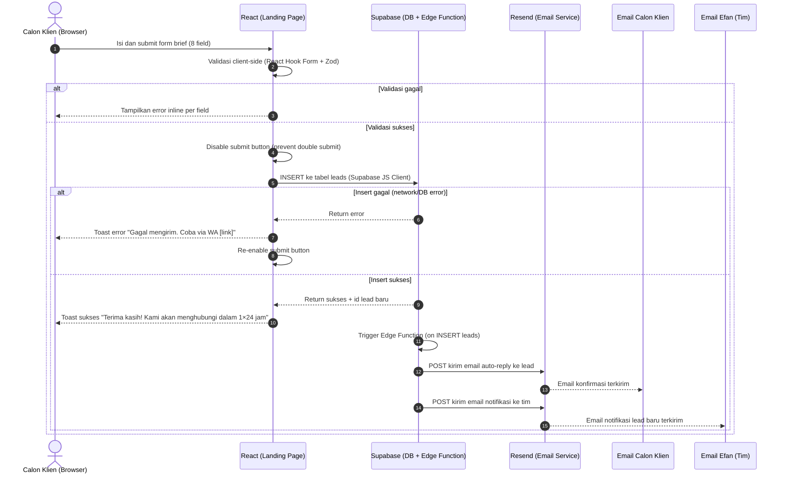
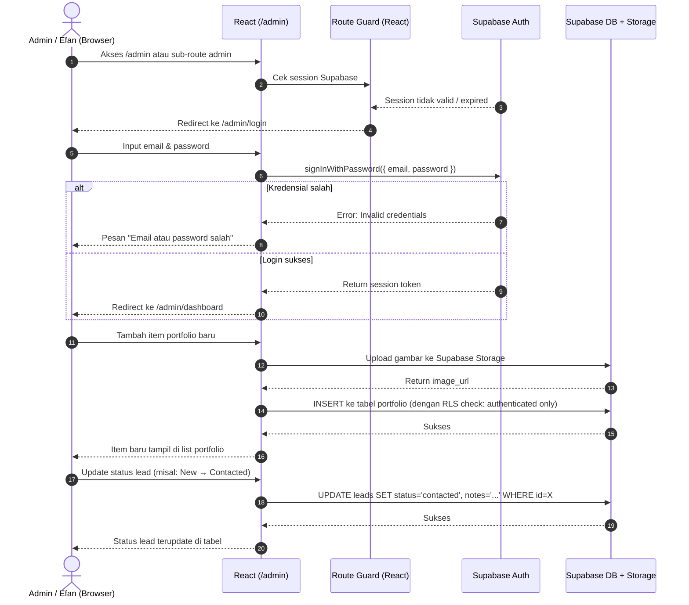
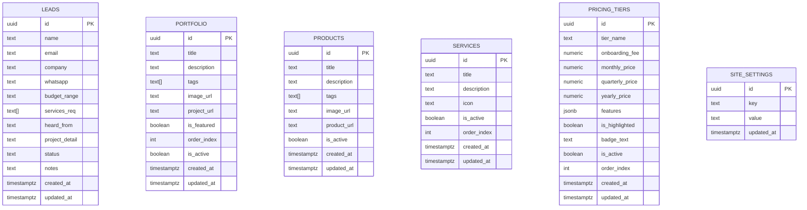

# PRD — Project Requirements Document
# Landing Page & Admin Panel — Kebetulan Serius

> **Versi:** 1.0
> **Status:** Draft Final
> **Dibuat:** Juni 2026
> **Target Go-Live:** Agustus 2026
> **Author:** Efan (CEO, Kebetulan Serius)

---

## 1. Overview

**Kebetulan Serius Landing Page & Admin Panel** adalah sebuah aplikasi berbasis web yang dirancang sebagai company profile digital sekaligus pintu masuk utama bagi calon klien untuk mengenal, mempercayai, dan menghubungi tim Kebetulan Serius.

**Masalah utama yang dihadapi tim Kebetulan Serius:**

1. **Kredibilitas yang sulit dibuktikan secara cepat** — calon klien sering mempertanyakan track record dan portfolio sebelum mau melangkah ke tahap brief atau pitching. Tidak ada halaman publik yang compact dan credible untuk mengatasi keberatan ini.
2. **Leads yang tidak terkelola** — tidak ada sistem terpusat untuk melacak calon klien yang sudah menghubungi tim, status follow-up, dan riwayat interaksinya.
3. **Konten yang sulit diperbarui** — tanpa sistem CMS, memperbarui portfolio, service, atau pricing memerlukan intervensi teknis langsung ke kode, memperlambat operasional.

**Solusi yang dibangun:**

Aplikasi ini hadir untuk menyelesaikan masalah tersebut dengan menyediakan dua layer dalam satu project:

- **Landing Page (Public):** Company profile yang compact, trusted, dan conversion-oriented sebagai wajah publik Kebetulan Serius. Dirancang untuk memandu calon klien dari awareness hingga mengirimkan brief project.
- **Admin Panel (Protected `/admin`):** Dashboard internal untuk mengelola konten (CMS: portfolio, service, pricing) dan leads masuk (mini-CRM: status tracking, notes, export) — semua dalam satu project yang sama.

**Target Audience Landing Page:**
- Startup lokal Indonesia yang butuh partner teknologi
- UMKM yang ingin digitalisasi bisnis
- Enterprise yang mencari software house yang credible dan bisa diajak berdiskusi

**Target Audience Admin Panel:**
- Tim internal Kebetulan Serius (Efan sebagai primary admin)

---

## 2. Requirements

### 2.1 Aksesibilitas & Tampilan

- Aplikasi berbasis web browser dan harus **Responsive** — dapat diakses dengan baik dan rapi melalui desktop, tablet, maupun smartphone.
- **Performa tinggi** adalah kebutuhan wajib: Lighthouse score ≥ 90, LCP < 3 detik — untuk mendukung SEO dan user experience yang baik.
- Animasi dan micro-interaction yang smooth menggunakan Framer Motion — tidak lebay, tapi terasa premium.

### 2.2 Landing Page (Public)

- Menampilkan arsitektur **multi-page**: Home, Services (dengan detail UI/UX & Web Dev untuk V1), Products, Pricing, dan Contact.
- Menggunakan bahasa Inggris untuk konten utama ("Contact Us", "Send inquiry").
- **Form brief/kontak** berada di halaman terpisah (/contact) dan berisi 8 field wajib:
  - Name
  - Email
  - Company
  - WhatsApp
  - Project Budget (dropdown/pilihan)
  - Service Required (Dropdown/pilihan)
  - Heard About Us (tag select option: Google, Instagram, Referral, LinkedIn, Lainnya)
  - Project Details (textarea)
- **Pricing Page** dengan toggle **Monthly / Quarterly / Yearly**, menampilkan 3 tier (Basic, Growth, Custom) dengan fitur tabel Compare Plan dan FAQ.
- Harga ditampilkan **secara publik** di pricing page dalam mata uang IDR.

### 2.3 Admin Panel (Protected `/admin`)

- Diakses melalui route `/admin` dalam project React yang sama.
- Jika tidak terautentikasi, redirect otomatis ke `/admin/login`.
- Mampu mengelola empat area:
  1. **Portfolio** — tambah, edit, hapus item portfolio.
  2. **Service** — tambah, edit, hapus layanan yang ditawarkan.
  3. **Pricing** — tambah, edit, hapus tier pricing beserta harga 3 periode dan list fitur.
  4. **Leads** — lihat semua lead masuk, update status, tambah notes, export CSV.
- **Lead Status Tracking:** `New` → `Contacted` → `Qualified` → `Closed (Won)` / `Closed (Lost)`.
- Single admin role (cukup untuk saat ini).

### 2.4 Otomatisasi Email

Setelah form lead tersubmit, sistem menjalankan dua otomatisasi secara bersamaan:

1. **Auto-reply ke calon klien** — email konfirmasi penerimaan brief, berisi ringkasan data yang dikirim dan informasi waktu respons ("Tim kami akan menghubungi lo dalam 1×24 jam via WA atau email").
2. **Notifikasi ke tim** — email ke Efan berisi nama lead, service yang diminati, budget range, dan link langsung ke detail lead di admin panel.

### 2.5 Keamanan Admin Panel

- Autentikasi via **Supabase Auth** (email + password).
- **Row Level Security (RLS)** di Supabase: setiap tabel sensitif dilindungi policy yang membatasi akses berdasarkan status autentikasi.
- **HTTPS** dengan SSL Certificate wajib aktif sebelum go-live.
- **Rate limiting** pada form submission: maksimal 3 kali submit per IP per jam — untuk mencegah spam dan abuse.
- `RESEND_API_KEY` dan data sensitif lainnya disimpan sebagai **Supabase Edge Function secrets**, tidak pernah sebagai environment variable frontend.

---

## 3. Out of Scope (v1)

Berikut adalah fitur-fitur yang secara eksplisit **tidak akan dibangun** di v1 untuk menjaga scope dan memastikan go-live tepat waktu:

| # | Fitur | Keterangan | Target |
|---|-------|-----------|--------|
| 1 | Blog / Artikel | Content marketing articles | v2 |
| 2 | Bilingual toggle (EN/ID) | Multi-language support | v2 |
| 3 | Multi-role admin | Role-based access di admin panel | v2 |
| 4 | Email follow-up sequence | Drip email campaign (Day 1, 3, 7) | v2 |
| 5 | Integrasi WhatsApp Business API | Notifikasi via WA | v2 |
| 6 | Integrasi dengan CRM eksternal | Sync ke sistem CRM terpisah Kebetulan Serius | v2 |
| 7 | Advanced analytics dashboard | Funnel report, conversion analytics | v2 |
| 8 | Live chat / chatbot | Real-time customer support widget | v2 |
| 9 | A/B Testing halaman | Variasi landing page untuk optimasi conversion | v2 |
| 10 | Testimonial / review system | Rating dan ulasan dari klien | v2 |

---

## 4. Core Features

Fitur-fitur inti dibagi dalam **4 modul utama:**

### Modul 1: Landing Page (Public)

Website tersusun dalam arsitektur **multi-page** untuk memandu calon klien secara komprehensif:

| # | Halaman | Isi / Section Utama |
|---|---------|---------------------|
| 1 | **Home (Landing Page)** | Navbar (Services, Solution, Products, Pricing), CTA "Contact Us". Hero Section (Tagline "We Build Digital Products...", Rating, CTA). Client Section (Tech Stack Logos). Trusted Section. Workflow Section. Our Projects (Portfolio showcase). Services Section (grid preview). Why Teams Choose KSP (Stat counters). Footer (4 kolom dengan 7 social media links). |
| 2 | **Services Modal/Page** | Grid card 7 layanan: AI & Integrated Automation, Web & Mobile App Development, SaaS Product Engineering, IoT System Integration, Post-Launch Support, UI/UX Design & Prototyping, IT Consulting & Solutions. |
| 3 | **Service Details (Khusus V1: UI/UX & Web Dev)** | Halaman detail layanan yang mendalam. Berisi hero service, grid portfolio/tech stack khusus service tersebut, breakdown layanan turunan, benefit/advantages, dan FAQ. (Layanan lain akan menggunakan template yang sama untuk sementara di V1). |
| 4 | **Products Page** | Showcase digital product internal team. (Tetap dipertahankan dan tidak digabung dengan Our Projects, namun memiliki halaman / section sendiri). |
| 5 | **Pricing Page** | Toggle **Monthly / Quarterly / Yearly**. 3 tier: Basic, Growth, Custom. Setiap tier: nama, model subscription (berbasis design hours, active project), harga (dalam IDR). Section **Compare Plan** (Tabel perbandingan detail fitur/SLA). Section **FAQ** dengan accordion. |
| 6 | **Contact Page** | Hero contact information. Form dengan 8 field: Name, Email, Company, WhatsApp, Project Budget (dropdown), Service Required (dropdown), Heard About Us (dropdown), Project Details. Tombol "Send inquiry". |


### Modul 2: Lead Management (Admin Panel)

Manajemen calon klien dari satu dashboard terpusat:

- **Dashboard Overview:** Counter total leads, breakdown per status (card), tabel leads terbaru (5 entri terakhir).
- **Lead List (Tabel Lengkap):** Kolom: Nama, Email, Company, Service Diminati, Budget Range, Tanggal Masuk, Status. Sortable dan filterable.
- **Lead Detail View:** Tampilkan semua 8 field dari form. Panel untuk: ubah status (dropdown), tambah/edit notes/catatan internal. Tombol simpan perubahan.
- **Lead Status Flow:**
  ```
  New → Contacted → Qualified → Closed (Won)
                              → Closed (Lost)
  ```
- **Export CSV:** Export semua lead atau dengan filter (rentang tanggal, status, service) ke format CSV — untuk kebutuhan laporan atau sync manual ke sistem lain.

### Modul 3: Content Management — CMS (Admin Panel)

**Portfolio (Our Projects) Manager:**
- CRUD item portfolio klien.
- Fields per item: Judul Project, Deskripsi (rich text/textarea), Tags (multi-tag input), Gambar Thumbnail (upload ke Supabase Storage, maks 2MB, format JPG/PNG/WebP), URL Project (opsional), `is_featured` (tampil di section hero/highlight), Urutan Tampil (`order_index`), Status Aktif.

**Products Manager:**
- CRUD digital product internal Kebetulan Serius.
- Fields per product: Nama Product, Deskripsi, Gambar Thumbnail, URL Product, Status Aktif.

**Service Manager:**
- CRUD untuk ke-7 layanan (AI, Web/Mobile, SaaS, IoT, Support, UI/UX, IT Consulting).
- Fields per service: Nama Layanan, Deskripsi, Icon, Sub-layanan (tags), Status Aktif, Urutan Tampil.

**Pricing Manager:**
- CRUD tier pricing.
- Fields per tier: Nama Tier, Onboarding Fee, Harga Monthly, Harga Quarterly, Harga Yearly, List Fitur (dinamis: bisa tambah/hapus item teks), `is_highlighted` (toggle badge "Paling Populer"), Teks Badge (bisa dikustomisasi), Status Aktif, Urutan Tampil.

### Modul 4: Email Automation

| Trigger | Penerima | Konten Email |
|---------|---------|-------------|
| Form inquiry berhasil disubmit | Calon klien (email dari form) | Ucapan terima kasih dalam bahasa Inggris (contoh: "Thank you for reaching out! We've received your inquiry."), ringkasan data yang dikirim, dan informasi SLA ("Our team will get back to you within 24 hours via WhatsApp or Email.") |
| Form inquiry berhasil disubmit | Efan (email admin) | Notifikasi lead baru: Nama, email, no WA, service diminati, budget range, detail project (singkat), dan link langsung ke `/admin/leads/{id}` |

---

## 5. User Flow

### 5.1 Calon Klien (Public User)

```
1. Akses Home Page
   └── Melihat hero section dengan tagline dan CTA

2. Eksplorasi Multi-Page
   ├── Navigasi ke halaman Services → melihat detail layanan
   ├── Navigasi ke halaman Products → melihat showcase internal product
   └── Navigasi ke halaman Pricing → membandingkan plan Basic, Growth, Custom di tabel Compare

3. Ambil aksi
   └── Klik CTA "Contact Us" dari navbar atau section lain
       └── Diarahkan ke halaman Contact (/contact)

4. Isi form inquiry
   └── Mengisi 8 field (Name, Email, Company, WA, Budget, Service, Heard About, Details)
       └── Klik tombol "Send inquiry"
           ├── [Loading state] Button disabled, spinner aktif
           └── [Sukses] Toast/banner konfirmasi

5. Konfirmasi
   ├── Email auto-reply terkirim ke calon klien
   └── Email notifikasi terkirim ke Efan

6. Follow-up (offline)
   └── Tim Kebetulan Serius menghubungi via WA/email dalam 1×24 jam
```

### 5.2 Admin — Tim Kebetulan Serius (Efan)

```
1. Akses /admin
   └── Cek session: jika tidak valid → redirect ke /admin/login
       └── Input email & password
           └── Autentikasi via Supabase Auth
               └── Redirect ke /admin/dashboard

2. Melihat dashboard
   ├── Lihat counter leads per status
   └── Lihat tabel leads terbaru

3. Kelola leads
   ├── Klik lead → buka halaman detail
   ├── Ubah status lead (misal: New → Contacted)
   ├── Tambah notes (misal: "Sudah WA, minta proposal hari Rabu")
   └── Simpan perubahan

4. Kelola konten (CMS)
   ├── Portfolio: tambah/edit/hapus item project
   ├── Service: tambah/edit/hapus layanan
   └── Pricing: update harga atau fitur per tier

5. Export laporan
   └── Lead List → atur filter → klik Export CSV
```

---

## 6. Non-Functional Requirements

| Kategori | Requirement | Target |
|---------|-------------|--------|
| **Performance** | Lighthouse Performance Score | ≥ 90 |
| **Performance** | Lighthouse Accessibility Score | ≥ 90 |
| **Performance** | Lighthouse SEO Score | ≥ 90 |
| **Performance** | Largest Contentful Paint (LCP) | < 3 detik |
| **Performance** | Bounce Rate | < 40% (diukur via GA4 bulan pertama) |
| **SEO** | Meta tags, OG tags (Open Graph untuk social share) | Wajib ada di v1 |
| **SEO** | `sitemap.xml` dan `robots.txt` | Wajib ada di v1 |
| **SEO** | Semantic HTML (H1, H2, alt text pada semua gambar) | Wajib di semua section |
| **Security** | HTTPS via SSL Certificate | Aktif sebelum go-live |
| **Security** | Admin route: redirect ke login jika session tidak valid | Wajib |
| **Security** | Supabase RLS aktif di semua tabel sensitif | Wajib |
| **Security** | Rate limiting pada form submission | Maks 3x per IP per jam |
| **Security** | Environment variables sensitif tidak ter-expose ke browser | Wajib (lihat bagian Deployment) |
| **Responsiveness** | Mobile (≥ 320px) | Wajib |
| **Responsiveness** | Tablet (≥ 768px) | Wajib |
| **Responsiveness** | Desktop (≥ 1280px) | Wajib |
| **Browser Support** | Chrome, Firefox, Safari, Edge (2 versi terakhir) | Wajib |
| **Uptime** | Ketersediaan server | ≥ 99% |
| **Analytics** | Google Analytics 4 terpasang | Wajib di v1 |
| **Analytics** | Microsoft Clarity (heatmap & session recording) | Wajib di v1 |
| **Image Optimization** | Semua gambar dioptimasi (WebP/compressed) | Wajib untuk Lighthouse score |

> **⚠️ Catatan SEO (React SPA):** Project ini menggunakan React.js (Client-Side Rendering / CSR) yang secara default kurang optimal untuk SEO dibandingkan Next.js (SSR/SSG). Untuk mitigasi, gunakan:
> - `react-helmet-async` untuk dynamic meta tags dan OG tags per section.
> - `vite-plugin-prerender` atau `@prerenderer/plugin-vite` untuk pre-rendering halaman statis saat build.
> - Jika SEO menjadi prioritas kritis di masa depan, migrasi ke Next.js direkomendasikan di v2.

---

## 7. Architecture

Aplikasi menggunakan pendekatan **JAMstack-lite:** React sebagai frontend SPA, Supabase sebagai Backend-as-a-Service (BaaS) yang menangani database, autentikasi, storage, dan serverless functions — serta Resend sebagai email service. Seluruh sistem di-deploy ke VPS Hostinger dengan Nginx sebagai web server.

```
┌─────────────────────────────────────────────────────────────────┐
│                        VPS Hostinger                           │
│                     (Ubuntu + Nginx)                           │
│                                                                │
│   ┌──────────────────────────────────────────────────────┐    │
│   │              React App (Static Build / /dist)         │    │
│   │                                                       │    │
│   │   ┌─────────────────────┐  ┌──────────────────────┐  │    │
│   │   │   Landing Page      │  │    Admin Panel       │  │    │
│   │   │   (Public Routes)   │  │   (/admin routes)    │  │    │
│   │   │   /                 │  │   /admin/login       │  │    │
│   │   │   /#services        │  │   /admin/dashboard   │  │    │
│   │   │   /#portfolio       │  │   /admin/leads       │  │    │
│   │   │   /#pricing         │  │   /admin/portfolio   │  │    │
│   │   │   /#contact         │  │   /admin/services    │  │    │
│   │   └──────────┬──────────┘  │   /admin/pricing     │  │    │
│   │              │             └──────────┬───────────┘  │    │
│   └──────────────┼──────────────────────  ┼─────────────┘    │
└──────────────────┼───────────────────────  ┼─────────────────┘
                   │                         │
                   ▼                         ▼
┌─────────────────────────────────────────────────────────────────┐
│                       Supabase (Cloud)                         │
│                                                                │
│  ┌─────────────────┐  ┌──────────────────┐  ┌──────────────┐  │
│  │  PostgreSQL DB  │  │  Supabase Auth   │  │   Storage    │  │
│  │  + RLS Policies │  │  (Admin Session) │  │  (Images)    │  │
│  └─────────────────┘  └──────────────────┘  └──────────────┘  │
│                                                                │
│  ┌─────────────────────────────────────────────────────────┐   │
│  │              Supabase Edge Function                    │   │
│  │   Trigger: INSERT on leads table                       │   │
│  │   Action: Call Resend API → kirim 2 email              │   │
│  └──────────────────────────────┬──────────────────────────┘   │
└─────────────────────────────────┼────────────────────────────┘
                                  │
                                  ▼
                   ┌──────────────────────────┐
                   │   Resend (Email Service) │
                   │                          │
                   │  1. Auto-reply → Lead    │
                   │  2. Notifikasi → Efan    │
                   └──────────────────────────┘
```

### Sequence Diagram 1 — Lead Form Submission (Calon Klien)



### Sequence Diagram 2 — Admin Login & Kelola Konten



---

## 8. Database Schema

Database menggunakan **PostgreSQL via Supabase**. Autentikasi admin dikelola sepenuhnya oleh **Supabase Auth** (built-in `auth.users`), sehingga tidak diperlukan tabel users manual terpisah.

### Tabel-tabel Utama:

**`leads`** — Data calon klien dari form landing page.
```
id              UUID          PRIMARY KEY DEFAULT gen_random_uuid()
name            TEXT          NOT NULL
email           TEXT          NOT NULL
company         TEXT
whatsapp        TEXT          NOT NULL
budget_range    TEXT          -- contoh: "<5jt", "5-15jt", "15-50jt", ">50jt"
services_req    TEXT[]        -- array: ["Web Dev", "UI/UX", "SaaS"]
heard_from      TEXT          -- "Google", "Instagram", "Referral", dll
project_detail  TEXT
status          TEXT          NOT NULL DEFAULT 'new'
                              -- ENUM values: new, contacted, qualified, closed_won, closed_lost
notes           TEXT          -- catatan internal admin
created_at      TIMESTAMPTZ   DEFAULT now()
updated_at      TIMESTAMPTZ   DEFAULT now()
```

**`portfolio`** — Item portfolio/case study yang tampil di landing page (Our Projects).
```
id              UUID          PRIMARY KEY DEFAULT gen_random_uuid()
title           TEXT          NOT NULL
description     TEXT
tags            TEXT[]        -- ["SaaS", "DMS", "Notaris"]
image_url       TEXT          -- URL dari Supabase Storage
project_url     TEXT          -- link live project (opsional)
is_featured     BOOLEAN       DEFAULT false -- tampil di highlight section
order_index     INTEGER       DEFAULT 0     -- urutan tampil
is_active       BOOLEAN       DEFAULT true  -- toggle tampil/sembunyikan
created_at      TIMESTAMPTZ   DEFAULT now()
updated_at      TIMESTAMPTZ   DEFAULT now()
```

**`products`** — Showcase digital product internal team.
```
id              UUID          PRIMARY KEY DEFAULT gen_random_uuid()
title           TEXT          NOT NULL
description     TEXT
tags            TEXT[]
image_url       TEXT          -- URL dari Supabase Storage
product_url     TEXT          -- link live product (opsional)
is_active       BOOLEAN       DEFAULT true
created_at      TIMESTAMPTZ   DEFAULT now()
updated_at      TIMESTAMPTZ   DEFAULT now()
```

**`services`** — Daftar layanan Kebetulan Serius.
```
id              UUID          PRIMARY KEY DEFAULT gen_random_uuid()
title           TEXT          NOT NULL  -- "Web & App Development"
description     TEXT
icon            TEXT          -- nama icon (misal: "Code2") atau path SVG
is_active       BOOLEAN       DEFAULT true
order_index     INTEGER       DEFAULT 0
created_at      TIMESTAMPTZ   DEFAULT now()
updated_at      TIMESTAMPTZ   DEFAULT now()
```

**`pricing_tiers`** — Tier pricing dengan 3 periode pembayaran.
```
id              UUID          PRIMARY KEY DEFAULT gen_random_uuid()
tier_name       TEXT          NOT NULL  -- "Basic", "Growth", "Enterprise"
onboarding_fee  NUMERIC(12,0) -- dalam IDR, angka bulat
monthly_price   NUMERIC(12,0)
quarterly_price NUMERIC(12,0)
yearly_price    NUMERIC(12,0)
features        JSONB         -- [{"text": "Up to 3 revisions", "included": true}, ...]
is_highlighted  BOOLEAN       DEFAULT false -- badge "Paling Populer"
badge_text      TEXT          -- teks badge, misal "Paling Populer" atau "Best Value"
is_active       BOOLEAN       DEFAULT true
order_index     INTEGER       DEFAULT 0
created_at      TIMESTAMPTZ   DEFAULT now()
updated_at      TIMESTAMPTZ   DEFAULT now()
```

**`site_settings`** — Konfigurasi site yang bisa di-update tanpa deploy ulang.
```
id              UUID          PRIMARY KEY DEFAULT gen_random_uuid()
key             TEXT          NOT NULL UNIQUE  -- "hero_tagline", "contact_email", dll
value           TEXT
updated_at      TIMESTAMPTZ   DEFAULT now()
```

### ER Diagram



### Row Level Security (RLS) Policy

> Semua tabel **HARUS** memiliki RLS enabled di Supabase. Berikut policy yang diterapkan:

| Tabel | Anon (Public) SELECT | Anon INSERT | Auth (Admin) ALL |
|-------|---------------------|-------------|-----------------|
| `leads` | ❌ Tidak boleh | ✅ Boleh (form submit) | ✅ Boleh semua |
| `portfolio` | ✅ Boleh | ❌ Tidak boleh | ✅ Boleh semua |
| `services` | ✅ Boleh | ❌ Tidak boleh | ✅ Boleh semua |
| `pricing_tiers` | ✅ Boleh | ❌ Tidak boleh | ✅ Boleh semua |
| `site_settings` | ❌ Tidak boleh | ❌ Tidak boleh | ✅ Boleh semua |

**SQL Policy penting untuk leads (anon INSERT):**
```sql
-- Allow anonymous users to submit leads (form submission)
CREATE POLICY "Allow anon insert leads"
ON leads FOR INSERT
TO anon
WITH CHECK (true);

-- Allow authenticated users (admin) full access
CREATE POLICY "Allow authenticated full access"
ON leads FOR ALL
TO authenticated
USING (true)
WITH CHECK (true);
```

---

## 9. Tech Stack

| Layer | Teknologi | Versi | Keterangan |
|-------|-----------|-------|------------|
| **Frontend Framework** | React (typescript) | 18+ | SPA dengan Vite sebagai build tool |
| **Build Tool** | Vite | 5+ | Fast dev server dan optimized production build |
| **Styling** | Tailwind CSS | 3+ | Utility-first CSS |
| **Animation** | Framer Motion | 11+ | Scroll animations, page transitions, micro-interactions |
| **Routing** | React Router | v6+ | Client-side routing + protected admin routes |
| **Form Management** | React Hook Form | 7+ | Performant form handling |
| **Validation** | Zod | 3+ | Schema validation untuk form dan data |
| **Backend as a Service** | Supabase | Latest | PostgreSQL, Auth, Storage, Edge Functions |
| **Email Service** | Resend | Latest | Transactional email: auto-reply + notifikasi tim |
| **SEO** | react-helmet-async | Latest | Dynamic meta tags, OG tags, title per section |
| **Analytics** | Google Analytics 4 | — | User behavior tracking, conversion events |
| **Heatmap** | Microsoft Clarity | — | Heatmap, session recording, rage click detection |
| **HTTP / DB Client** | Supabase JS Client | 2+ | Direct DB/Auth/Storage interaction, no separate API layer |
| **Icon Library** | Lucide React | Latest | Konsisten, lightweight, tree-shakable |
| **Notification/Toast** | Sonner atau React Hot Toast | Latest | UI feedback saat form submit |
| **Web Server** | Nginx | Latest | Serve static build, handle SPA routing |
| **Deployment Target** | VPS Hostinger | — | Ubuntu 22.04 LTS |
| **SSL** | Let's Encrypt via Certbot | — | Free SSL certificate |
| **Version Control** | Git + GitHub | — | Source control + deployment trigger |

---

## 10. Error Handling & Edge Cases

| Skenario | Penanganan |
|----------|-----------|
| Form disubmit dengan field wajib kosong | Client-side validation (Zod + React Hook Form) menampilkan pesan error merah inline di bawah field sebelum request ke Supabase |
| Submit form gagal (network error atau Supabase down) | Toast merah: "Gagal mengirim brief. Coba lagi atau hubungi langsung via WA [link WA Efan]" |
| Double submit (klik tombol 2x cepat) | Tombol submit di-disable dan menampilkan loading spinner setelah klik pertama; re-enable jika terjadi error |
| Rate limit tercapai (> 3x submit per IP per jam) | Tampilkan pesan: "Kamu sudah mengirim beberapa brief. Tim kami akan segera menghubungimu." |
| Email auto-reply gagal terkirim | Lead tetap tersimpan di database. Error dicatat di Supabase Edge Function logs. Notifikasi ke tim tetap dikirim. Admin bisa follow-up manual. |
| Admin login dengan password salah | Pesan generic: "Email atau password salah." — tanpa detail mana yang salah (security best practice) |
| Admin session expired di tengah sesi | Middleware React Router mendeteksi session tidak valid → redirect ke `/admin/login`. State form yang sedang diisi hilang (acceptable trade-off) |
| Upload gambar portfolio terlalu besar | Client-side validation: maks 2MB, format hanya JPG/PNG/WebP. Pesan error: "Ukuran gambar maks 2MB. Gunakan format JPG, PNG, atau WebP." |
| Konten CMS kosong (portfolio/service belum diisi) | Landing page menampilkan skeleton placeholder yang graceful — tidak crash, tidak menampilkan pesan error ke pengunjung |
| Gambar portfolio gagal load | `` tag menggunakan `onError` handler untuk menampilkan placeholder image |
| Halaman admin diakses langsung via URL (direct link) | Protected route guard cek session → jika invalid, redirect ke login → setelah login, redirect kembali ke halaman yang dituju |

---

## 11. Supabase Queries & Edge Functions Overview

Karena menggunakan Supabase sebagai BaaS, tidak ada REST API custom yang dibangun. Semua interaksi data menggunakan **Supabase JS Client** langsung dari React. Berikut mapping operasi utama:

### Landing Page (Public — tanpa auth):

| Operasi | Supabase Query |
|---------|---------------|
| Fetch portfolio aktif | `supabase.from('portfolio').select('*').eq('is_active', true).order('order_index')` |
| Fetch services aktif | `supabase.from('services').select('*').eq('is_active', true).order('order_index')` |
| Fetch pricing tiers aktif | `supabase.from('pricing_tiers').select('*').eq('is_active', true).order('order_index')` |
| Submit lead form | `supabase.from('leads').insert([{ ...formData }])` |

### Admin Panel (Protected — `authenticated` role):

| Operasi | Supabase Query |
|---------|---------------|
| Login | `supabase.auth.signInWithPassword({ email, password })` |
| Logout | `supabase.auth.signOut()` |
| Cek session aktif | `supabase.auth.getSession()` |
| Get semua leads | `supabase.from('leads').select('*').order('created_at', { ascending: false })` |
| Update lead status + notes | `supabase.from('leads').update({ status, notes, updated_at: new Date() }).eq('id', leadId)` |
| CRUD portfolio | Full CRUD via `supabase.from('portfolio')` |
| CRUD services | Full CRUD via `supabase.from('services')` |
| CRUD pricing tiers | Full CRUD via `supabase.from('pricing_tiers')` |
| Upload gambar portfolio | `supabase.storage.from('portfolio-images').upload(filePath, file)` |
| Get public URL gambar | `supabase.storage.from('portfolio-images').getPublicUrl(filePath)` |
| Delete gambar lama | `supabase.storage.from('portfolio-images').remove([filePath])` |

### Supabase Edge Function:

| Nama Function | Trigger | Aksi |
|--------------|---------|------|
| `on-new-lead` | Database Webhook: `INSERT` on `leads` table | 1. Kirim email auto-reply ke lead via Resend API. 2. Kirim email notifikasi ke `ADMIN_EMAIL` via Resend API. |

**Struktur Edge Function `on-new-lead`:**
```typescript
// supabase/functions/on-new-lead/index.ts
import { Resend } from "npm:resend";

const resend = new Resend(Deno.env.get("RESEND_API_KEY"));
const ADMIN_EMAIL = Deno.env.get("ADMIN_EMAIL");
const FROM_EMAIL = "noreply@kebetulanserius.com";

Deno.serve(async (req) => {
  const { record } = await req.json(); // data lead dari webhook

  // 1. Auto-reply ke lead
  await resend.emails.send({
    from: FROM_EMAIL,
    to: record.email,
    subject: "We have received your project inquiry! 🎯",
    html: buildAutoReplyTemplate(record),
  });

  // 2. Notifikasi ke tim
  await resend.emails.send({
    from: FROM_EMAIL,
    to: ADMIN_EMAIL,
    subject: `[Lead Baru] ${record.name} - ${record.services_req?.join(", ")}`,
    html: buildAdminNotifTemplate(record),
  });

  return new Response(JSON.stringify({ ok: true }), { status: 200 });
});
```

---

## 12. Success Metrics

Berikut adalah indikator keberhasilan project ini — diukur mulai hari go-live:

| Metrik | Target | Cara Ukur | Timeline |
|--------|--------|-----------|---------|
| **Lighthouse Score** | ≥ 90 semua kategori | Lighthouse audit | Saat launch |
| **LCP** | < 3 detik | Lighthouse / GA4 Core Web Vitals | Saat launch |
| **Bounce Rate** | < 40% | GA4 | Bulan 1-3 |
| **Form Conversion Rate** | > 3% dari total visitor | (Total form submit / total visitor) × 100 di GA4 | Bulan 1-3 |
| **Lead Masuk** | 1–2 leads per bulan | Admin panel lead counter | Bulan 1-3 |
| **Admin Content Update** | < 5 menit per 1 item | Internal usability test | Setelah launch |
| **Uptime** | ≥ 99% | UptimeRobot (free tier monitoring) | Ongoing |
| **Email Delivery Rate** | ≥ 95% | Resend dashboard | Ongoing |
| **Page Load Time** | < 2 detik (desktop) | GA4 / Clarity | Bulan 1 |

---

## 13. Deployment & Environment

### Environment Variables

**Frontend (prefix `VITE_` — ter-expose ke browser, TIDAK boleh berisi secret):**
```bash
VITE_SUPABASE_URL=https://xxxxxxxxxxxx.supabase.co
VITE_SUPABASE_ANON_KEY=eyJhbGciOiJIUzI1NiIsInR5cCI6IkpXVCJ9...
VITE_GA_MEASUREMENT_ID=G-XXXXXXXXXX
```

**Supabase Edge Function Secrets (TIDAK ter-expose ke browser):**
```bash
RESEND_API_KEY=re_xxxxxxxxxxxxxxxxxxxx
ADMIN_EMAIL=efan@kebetulanserius.com
```

> **⚠️ Security Rule:** `RESEND_API_KEY`, `ADMIN_EMAIL`, dan credential sensitif lainnya **HARUS** disimpan sebagai Supabase Edge Function Secrets (via Supabase Dashboard → Settings → Edge Functions), **BUKAN** sebagai environment variable di frontend. Apapun yang di-prefix `VITE_` akan ter-bundle dan dapat dilihat siapapun di browser developer tools.

### Struktur Folder Project

```
kebetulanserius-web/
├── public/
│   ├── favicon.ico
│   ├── sitemap.xml
│   └── robots.txt
├── src/
│   ├── components/
│   │   ├── home/             # Home page components (Hero, Trusted Section, dll)
│   │   ├── services/         # Services components
│   │   ├── pricing/          # Pricing components
│   │   ├── contact/          # Contact components
│   │   ├── admin/            # Admin panel components
│   │   └── shared/           # Shared UI components (Navbar, Footer, Button, dll)
│   ├── pages/
│   │   ├── HomePage.tsx
│   │   ├── ServicesPage.tsx
│   │   ├── ServiceDetailUIUX.tsx
│   │   ├── ServiceDetailWebMobile.tsx
│   │   ├── ProductsPage.tsx
│   │   ├── PricingPage.tsx
│   │   ├── ContactPage.tsx
│   │   └── admin/
│   │       ├── Login.tsx
│   │       ├── Dashboard.tsx
│   │       ├── Leads.tsx
│   │       ├── LeadDetail.tsx
│   │       ├── Portfolio.tsx
│   │       ├── Services.tsx
│   │       └── Pricing.tsx
│   ├── hooks/                # Custom hooks (useAuth, useLeads, dll)
│   ├── lib/
│   │   ├── supabase.ts       # Supabase client init
│   │   └── utils.ts
│   ├── styles/
│   │   └── globals.css       # Tailwind base + custom CSS variables
│   ├── App.tsx               # Router setup + route protection
│   └── main.tsx
├── supabase/
│   └── functions/
│       └── on-new-lead/
│           └── index.ts
├── .env                      # Local development only (gitignored)
├── .env.example              # Template env vars (committed)
├── vite.config.js
├── tailwind.config.js
└── package.json
```

### Route Protection (React Router + Supabase)

```jsx
// src/components/ProtectedRoute.tsx
import { Navigate } from 'react-router';
import { useAuth } from '../hooks/useAuth';

export function ProtectedRoute({ children }) {
  const { session, loading } = useAuth();
  if (loading) return <LoadingSpinner />;
  if (!session) return <Navigate to="/admin/login" replace />;
  return children;
}

// src/App.tsx
<Routes>
  <Route path="/" element={<HomePage />} />
  <Route path="/services" element={<ServicesPage />} />
  <Route path="/services/ui-ux" element={<ServiceDetailUIUX />} />
  <Route path="/services/web-mobile" element={<ServiceDetailWebMobile />} />
  <Route path="/products" element={<ProductsPage />} />
  <Route path="/pricing" element={<PricingPage />} />
  <Route path="/contact" element={<ContactPage />} />
  <Route path="/admin/login" element={<AdminLogin />} />
  <Route path="/admin/*" element={
    <ProtectedRoute>
      <AdminLayout />
    </ProtectedRoute>
  } />
</Routes>
```

### Nginx Configuration (VPS Hostinger)

```nginx
server {
    listen 80;
    server_name kebetulanserius.com www.kebetulanserius.com;
    return 301 https://$server_name$request_uri;
}

server {
    listen 443 ssl http2;
    server_name kebetulanserius.com www.kebetulanserius.com;

    root /var/www/kebetulanserius/dist;
    index index.html;

    # Handle React Router (SPA — semua route pointing ke index.html)
    location / {
        try_files $uri $uri/ /index.html;
    }

    # Cache static assets aggressively
    location ~* \.(js|css|png|jpg|jpeg|gif|svg|ico|woff|woff2|webp)$ {
        expires 1y;
        add_header Cache-Control "public, immutable";
    }

    # Security headers
    add_header X-Frame-Options "SAMEORIGIN" always;
    add_header X-Content-Type-Options "nosniff" always;
    add_header Referrer-Policy "strict-origin-when-cross-origin" always;

    ssl_certificate /etc/letsencrypt/live/kebetulanserius.com/fullchain.pem;
    ssl_certificate_key /etc/letsencrypt/live/kebetulanserius.com/privkey.pem;
    ssl_protocols TLSv1.2 TLSv1.3;
}
```

### Deployment Checklist (Pre Go-Live)

- [ ] `npm run build` — production build sukses tanpa error
- [ ] Upload `/dist` ke VPS via SSH atau GitHub Actions CI/CD
- [ ] Konfigurasi Nginx (SPA routing + caching)
- [ ] SSL aktif via Certbot Let's Encrypt
- [ ] Domain DNS diarahkan ke IP VPS Hostinger
- [ ] Supabase project dibuat, semua tabel + RLS policies aktif
- [ ] Supabase Edge Function `on-new-lead` deployed
- [ ] Edge Function secrets diset (RESEND_API_KEY, ADMIN_EMAIL)
- [ ] Test form submission end-to-end (cek auto-reply email + notif tim)
- [ ] Test admin login, CRUD portfolio, CRUD pricing
- [ ] Test lead status update dan export CSV
- [ ] GA4 dan Microsoft Clarity tracking live (cek di real-time dashboard)
- [ ] Lighthouse audit — semua skor ≥ 90
- [ ] sitemap.xml dan robots.txt dapat diakses
- [ ] OG Tags ditest via [opengraph.xyz](https://www.opengraph.xyz)
- [ ] Mobile responsiveness dicek di device nyata (HP Android & iOS)
- [ ] UptimeRobot monitoring disetup

---

## 14. Glossary

| Istilah | Definisi |
|---------|---------|
| **Lead** | Calon klien yang sudah mengisi form brief di landing page, namun belum onboarding atau menandatangani kontrak |
| **Client / Klien** | Entitas yang sudah melakukan onboarding dan memiliki kontrak aktif dengan Kebetulan Serius |
| **Brief** | Informasi awal tentang kebutuhan project dari calon klien — diisi melalui form di landing page |
| **Admin Panel** | Area khusus internal tim Kebetulan Serius (route `/admin`) untuk mengelola konten dan leads |
| **CMS** | Content Management System — sistem pengelolaan konten (portfolio, service, pricing) tanpa perlu menyentuh kode langsung |
| **Onboarding Fee** | Biaya satu kali di awal engagement klien, terpisah dari biaya retainer bulanan |
| **Retainer** | Biaya berlangganan periodik (monthly/quarterly/yearly) untuk layanan ongoing dari Kebetulan Serius |
| **Tier** | Level paket layanan: Basic, Growth, Enterprise |
| **Supabase** | Backend-as-a-Service yang menyediakan PostgreSQL database, autentikasi, file storage, dan edge functions dalam satu platform |
| **Edge Function** | Serverless function yang berjalan di Supabase cloud — digunakan untuk trigger email saat lead masuk |
| **RLS** | Row Level Security — fitur keamanan Supabase/PostgreSQL untuk membatasi akses data per baris tabel berdasarkan status autentikasi atau kondisi lain |
| **SPA** | Single Page Application — aplikasi web yang di-load sekali dan navigasi antar halaman tanpa full page reload |
| **LCP** | Largest Contentful Paint — metrik Core Web Vitals yang mengukur waktu render elemen terbesar di halaman |
| **Anon Key** | API key Supabase yang aman untuk digunakan di frontend (public) — hanya boleh akses sesuai RLS policy |
| **VITE_** | Prefix environment variable di Vite yang akan di-bundle ke dalam JavaScript dan **ter-expose ke browser** |
| **v1** | Versi pertama yang diluncurkan — scope sudah ditetapkan di dokumen ini |
| **v2** | Versi pengembangan berikutnya setelah v1 live dan stabil |
| **is_featured** | Flag boolean di tabel portfolio untuk menandai project yang ditampilkan di section highlight / hero |
| **order_index** | Angka urutan untuk mengontrol tampilan konten (portfolio, service, pricing) tanpa perlu ubah kode |

---

## 15. Status Implementasi Fitur/Modul (AI Context)

> **⚠️ PERHATIAN UNTUK AI AGENT:**
> Tabel di bawah ini berfungsi sebagai tracker status pengerjaan fitur/modul. **JANGAN MENYENTUH ATAU MERUSAK FITUR YANG STATUSNYA "✅ SELESAI" ATAU "🚧 DALAM PENGERJAAN" (KECUALI DIMINTA SECARA EKSPLISIT OLEH USER).** Fokus pengerjaan hanya pada modul yang masih berstatus "⏳ Belum Dimulai". Saat diminta mengerjakan fitur baru, harap update status fitur tersebut di tabel ini.

| Modul/Fitur | Lokasi / Halaman | Status | Catatan / Tanggal Selesai |
|-------------|------------------|--------|---------------------------|
| **Project Setup & Base Config** | Vite, Tailwind, React Router | ⏳ Belum Dimulai | - |
| **Shared Components** | Navbar, Footer, UI System | ⏳ Belum Dimulai | - |
| **Modul 1: Home Page** | `/` | ⏳ Belum Dimulai | - |
| **Modul 1: Services Page** | `/services` | ⏳ Belum Dimulai | - |
| **Modul 1: Service Detail Pages** | `/services/ui-ux`, `/services/web-mobile` | ⏳ Belum Dimulai | - |
| **Modul 1: Products Page** | `/products` | ⏳ Belum Dimulai | - |
| **Modul 1: Pricing Page** | `/pricing` | ⏳ Belum Dimulai | - |
| **Modul 1: Contact Page & Form** | `/contact` | ⏳ Belum Dimulai | - |
| **Modul 2: Admin Authentication** | `/admin/login` | ⏳ Belum Dimulai | - |
| **Modul 2: Admin Dashboard & Leads** | `/admin/dashboard`, `/admin/leads` | ⏳ Belum Dimulai | - |
| **Modul 3: CMS (Our Projects)** | `/admin/portfolio` | ⏳ Belum Dimulai | - |
| **Modul 3: CMS (Products)** | `/admin/products` | ⏳ Belum Dimulai | - |
| **Modul 3: CMS (Services)** | `/admin/services` | ⏳ Belum Dimulai | - |
| **Modul 3: CMS (Pricing)** | `/admin/pricing` | ⏳ Belum Dimulai | - |
| **Modul 4: Email Automation** | Supabase Edge Functions + Resend | ⏳ Belum Dimulai | - |
| **Supabase Integration & RLS** | Database, Storage, RLS Policies | ⏳ Belum Dimulai | - |

---

*PRD ini adalah working document untuk development Kebetulan Serius Landing Page & Admin Panel.*
*Dibuat berdasarkan brief dari Efan (CEO, Kebetulan Serius) dan AI Agent (Strategic Partner).*
*Versi 1.1 — Juni 2026. Target go-live: Agustus 2026.*
